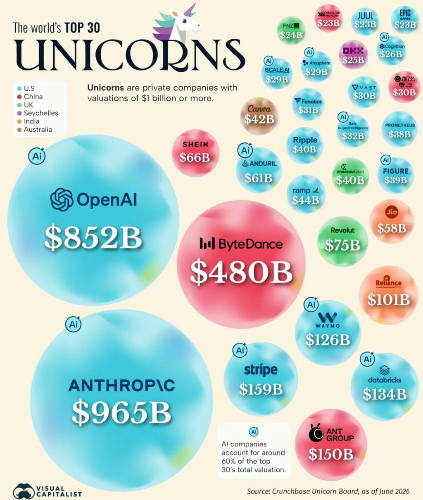
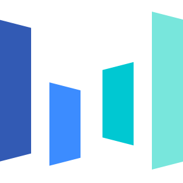
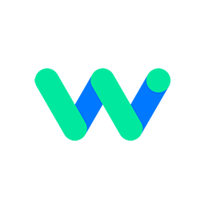
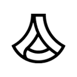

# 세계 Top 30 유니콘 (2026년 6월 기준)

출처: Crunchbase Unicorn Board 집계, Visual Capitalist 인포그래픽 (as of June 2026)

## 들어가며

유니콘(unicorn)은 기업가치 10억 달러 이상의 비상장 기업을 뜻한다. 이 표는 그 가운데 가치가 가장 높은 30곳을 모은 것이다. 눈에 띄는 특징이 셋 있다.

- **AI 쏠림**: 인포그래픽 기준으로 상위 30곳 합산 가치의 약 60%가 AI 기업에서 나온다. 1위 Anthropic, 2위 OpenAI가 각각 1조 달러에 육박한다.
- **미국 압도**: 30곳 중 절반 이상이 미국 기업이다. 그다음이 중국(ByteDance, Ant Group 등)과 인도(Reliance Retail, Jio)의 거대 내수 기업, 영국 핀테크(Revolut, Checkout.com, FNZ)다.
- **사모 자본의 시대**: 이들은 IPO를 미룬 채 사모 시장에서 수십조 원대 가치를 인정받는다.

한 가지 주의할 점이 있다. 비상장 기업의 가치는 공개 시장가가 아니라 **가장 최근의 투자 라운드(post-money)나 구주 거래(secondary, tender offer)에서 매겨진 값**이다. 그래서 일부 수치는 과거의 정점이거나(예: Checkout.com의 $40B는 2022년 정점이고 2025년 내부 평가액은 약 $12B) 집계 기관의 추정치다. 아래 각 항목에 근거와 시점을 함께 적었고, 불확실한 값에는 (추정)을 붙였다.

## 한눈에 보기

| # | 기업 | 가치 | 국가 | 분야 | AI |
|---|------|------|------|------|:--:|
| 1 | Anthropic | $965B | 미국 | AI 안전 연구 | ● |
| 2 | OpenAI | $852B | 미국 | 생성형 AI | ● |
| 3 | ByteDance | $480B | 중국 | 소셜/콘텐츠 | ● |
| 4 | Stripe | $159B | 미국 | 핀테크(결제) | |
| 5 | Ant Group | $150B | 중국 | 핀테크 | ● |
| 6 | Databricks | $134B | 미국 | 데이터/AI | ● |
| 7 | Waymo | $126B | 미국 | 자율주행 | ● |
| 8 | Reliance Retail | $101B | 인도 | 리테일 | |
| 9 | Revolut | $75B | 영국 | 핀테크(네오뱅크) | |
| 10 | SHEIN | $66B | 싱가포르 | 이커머스 | |
| 11 | Anduril | $61B | 미국 | 방위/자율시스템 | ● |
| 12 | Jio Platforms | $58B | 인도 | 통신/디지털 | |
| 13 | Ramp | $44B | 미국 | 핀테크/AI | ● |
| 14 | Canva | $42B | 호주 | 디자인 SW | ● |
| 15 | Ripple | $40B | 미국 | 크립토 결제 | |
| 16 | Checkout.com | $40B* | 영국 | 핀테크(결제) | |
| 17 | Figure | $39B | 미국 | 휴머노이드 로봇 | ● |
| 18 | Project Prometheus | $38B | 미국 | 물리 AI | ● |
| 19 | Safe Superintelligence | $32B | 미국 | AI 연구 | ● |
| 20 | Fanatics | $31B | 미국 | 스포츠 커머스 | |
| 21 | VAST Data | $30B | 미국 | AI 데이터 인프라 | ● |
| 22 | Xiaohongshu (RED) | $30B | 중국 | 소셜 커머스 | |
| 23 | Scale AI | $29B | 미국 | AI 데이터 | ● |
| 24 | Anysphere (Cursor) | $29B | 미국 | AI 개발도구 | ● |
| 25 | Cognition (Devin) | $26B | 미국 | AI 소프트웨어 | ● |
| 26 | OKX | $25B | 세이셸 | 크립토 거래소 | |
| 27 | FNZ | $24B | 영국 | 웰스테크 | |
| 28 | Yangtze Memory (YMTC) | $23B | 중국 | 반도체(NAND) | |
| 29 | JUUL | $23B | 미국 | 전자담배 | |
| 30 | Epic Games | $23B | 미국 | 게임/엔진 | |

`*` Checkout.com의 $40B는 2022년 정점이며, 2025년 내부 평가액은 약 $12B다. 그 외 SHEIN, JUUL, Epic Games도 정점 대비 하락한 값이다.

---

## 기업별 정리

###  1. Anthropic ($965B)

- **설립/본사**: 2021년 설립 / 창업자는 Dario Amodei, Daniela Amodei 남매를 포함한 전 OpenAI 연구진 / 본사 미국 샌프란시스코
- **분류**: AI 안전 연구, 파운데이션 모델 (AI)
- **사업**: 대화형 AI 모델 Claude를 개발하는 AI 안전 연구소다. API와 구독 서비스(Claude 유료 플랜), 기업용 라이선스로 매출을 낸다.
- **주요 투자자**: Capital Group, Coatue, D1 Capital, GIC, ICONIQ, 그리고 이전 라운드의 Microsoft, NVIDIA, Google, Accel
- **valuation 근거**: 2026년 5월 마감한 Series H에서 $65B를 조달하며 post-money $965B를 기록했다. 이 라운드로 OpenAI를 제치고 세계 최고가 AI 스타트업이 됐다.
- **임팩트**: Claude는 코딩, 문서 작성, 에이전트 자동화 전반에서 널리 쓰이며 실무 생산성 도구로 자리 잡았다. AI 안전을 핵심 가치로 내세워 책임 있는 개발 기준 논의를 주도한다.
- **왜 이 가치인가**: 런레이트 매출이 빠르게 성장하며 최상위 모델 성능과 안전 브랜드가 해자로 작동한다.
- **링크**: [공식 사이트](https://www.anthropic.com) / [Series H 발표](https://www.anthropic.com/news)

###  2. OpenAI ($852B)

- **설립/본사**: 2015년 설립 / 창업자 Sam Altman, Greg Brockman, Elon Musk, Ilya Sutskever 등 / 본사 미국 샌프란시스코
- **분류**: 파운데이션 모델, 생성형 AI (AI)
- **사업**: ChatGPT와 GPT 계열 모델을 만드는 AI 기업이다. ChatGPT 구독(Plus/Pro/Enterprise), API 사용료, 기업 계약으로 매출을 올린다.
- **주요 투자자**: Microsoft, NVIDIA, SoftBank, Amazon, Andreessen Horowitz, Sequoia, Thrive Capital, Fidelity 등
- **valuation 근거**: 2026년 3월 마감한 라운드에서 대규모 자금을 조달하며 약 $852B로 평가됐다. IPO 시 $1T 목표가 거론되나 상장 시점은 미뤄질 가능성이 보도됐다.
- **임팩트**: ChatGPT는 생성형 AI를 대중화시킨 대표 제품으로 검색, 업무, 교육 방식을 바꿨다. 전 세계 AI 도입 흐름과 규제 논의의 중심에 있다.
- **왜 이 가치인가**: 압도적 사용자 규모와 브랜드, 급성장하는 매출이 강력한 해자다. 다만 Anthropic에 최고 valuation 자리를 내준 상태다.
- **링크**: [공식 사이트](https://openai.com) / [OpenAI News](https://openai.com/news/)

###  3. ByteDance ($480B)

- **설립/본사**: 2012년 설립 / 창업자 장이밍(Zhang Yiming), 량루보(Liang Rubo) / 본사 중국 베이징 (싱가포르에 국제 본부)
- **분류**: 소셜미디어, 콘텐츠 플랫폼 (AI)
- **사업**: 숏폼 영상 플랫폼 틱톡(TikTok)과 중국 내수판 더우인(Douyin)을 운영하는 세계 최대 비상장 인터넷 기업이다. 뉴스 앱 진르터우탸오, 영상편집 CapCut 등을 함께 서비스하며 추천 알고리즘 AI가 핵심 경쟁력이다.
- **주요 투자자**: SoftBank, General Atlantic, HongShan(구 Sequoia China), KKR, Coatue, Tiger Global
- **valuation 근거**: 2025년 약 $330B 규모 자사주 매입에 이어, 2026년 세컨더리 거래에서 약 $550B로 평가됐다는 보도가 있다(인포그래픽 기준가 $480B, $550B는 추정).
- **임팩트**: 틱톡은 전 세계 10억 명 이상이 쓰는 대표 숏폼 플랫폼으로 콘텐츠 소비와 광고, 커머스 생태계를 바꿔놓았다. 데이터 안보를 둘러싼 미중 갈등의 상징이기도 하다.
- **왜 이 가치인가**: 압도적 사용자 기반과 광고 매출, AI 추천 역량이 결합돼 비상장 기업 중 최고 수준의 가치를 인정받는다.
- **링크**: [공식 사이트](https://www.bytedance.com) / [관련 보도](https://americanbazaaronline.com/2026/02/25/tiktoks-parent-bytedance-valued-at-550-billion-in-a-proposed-sale-475860/)

###  4. Stripe ($159B)

- **설립/본사**: 2010년 설립 / 창업자 John Collison, Patrick Collison 형제 / 본사 미국 샌프란시스코(더블린 공동 본사)
- **분류**: 결제 인프라 핀테크
- **사업**: 온라인 결제 처리 API를 핵심으로 하는 결제 인프라 기업이다. 결제 게이트웨이, 구독 청구(Billing), 부정거래 방지(Radar), 대금 정산(Connect) 등 개발자 친화적 금융 인프라를 제공한다. 연간 처리액이 1조 달러를 넘는다.
- **주요 투자자**: Thrive Capital, Coatue, Andreessen Horowitz, Sequoia, General Catalyst
- **valuation 근거**: 2026년 2월 직원, 주주 대상 공개매수(tender offer)에서 $159B로 평가됐다. 1년 전 $91.5B 대비 74% 상승한 수치다.
- **임팩트**: 인터넷 경제의 결제 배관 역할을 하며, 스타트업이 몇 줄의 코드로 결제를 붙일 수 있게 만들었다. 전 세계 전자상거래 성장의 기반 인프라다.
- **왜 이 가치인가**: 자체 자금으로 성장하는 고성장, 고마진 결제 인프라로 IPO 없이도 valuation이 계속 오른다.
- **링크**: [공식 사이트](https://stripe.com) / [CNBC 보도](https://www.cnbc.com/2026/02/24/stripe-value-stock-sale-tender-offer.html)

###  5. Ant Group ($150B)

- **설립/본사**: 2014년 법인화(알리페이 자체는 2004년 출범) / 창업자 마윈(Jack Ma), 펑레이(Lucy Peng) / 본사 중국 항저우
- **분류**: 핀테크, 결제 (AI)
- **사업**: 10억 명 이상이 쓰는 모바일 결제 플랫폼 알리페이(Alipay)를 운영하는 알리바바 계열 핀테크다. 결제와 송금뿐 아니라 대출(화베이, 제베이), 자산관리(위어바오), 보험, 신용평가(즈마신용)를 아우르는 종합 금융 플랫폼이다.
- **주요 투자자**: 알리바바그룹(약 33%), 직원 지주회사, 중국 사회보장기금(NSSF), 중국생명(China Life)
- **valuation 근거**: 2020년 IPO 무산 이후 규제와 재편을 거쳐 가치가 크게 하향됐다. 2025년 자사주 매입 기준 약 $100B 안팎으로 평가됐다(인포그래픽 기준가 $150B, 집계 방식에 따른 차이).
- **임팩트**: 중국의 현금 없는 사회를 사실상 앤트가 구축했고, QR 결제와 소액 신용 모델은 신흥국 핀테크의 원형이 됐다. 2020년 사상 최대 IPO의 전격 중단은 중국 빅테크 규제의 분수령으로 기록된다.
- **왜 이 가치인가**: 거대한 결제, 신용 데이터와 사용자 락인은 강력하나, 규제 리스크가 가치의 상단을 누른다.
- **링크**: [공식 사이트](https://www.antgroup.com) / [Wikipedia](https://en.wikipedia.org/wiki/Ant_Group)

###  6. Databricks ($134B)

- **설립/본사**: 2013년 설립 / 창업자 Ali Ghodsi, Matei Zaharia, Ion Stoica 등 UC Berkeley AMPLab 출신 7인 / 본사 미국 샌프란시스코
- **분류**: 데이터, AI 플랫폼(레이크하우스) (AI)
- **사업**: 데이터 엔지니어링, 분석, 머신러닝을 하나로 묶는 Lakehouse 플랫폼을 클라우드 구독으로 제공한다. 최근에는 AI 에이전트용 서버리스 Postgres인 Lakebase, 대화형 분석 도구 Genie로 확장 중이다.
- **주요 투자자**: Thrive Capital, Andreessen Horowitz, DST Global, GIC, Insight Partners, T. Rowe Price
- **valuation 근거**: 2026년 초 Series L에서 약 $5B 지분 조달로 $134B를 기록했다. 이후 $5.4B 런레이트를 달성하며 더 높은 신규 라운드를 논의 중이라 실제 가치는 이보다 높을 수 있다.
- **임팩트**: 기업의 데이터 통합과 AI 도입을 뒷받침하는 핵심 인프라다. 오픈소스 Apache Spark 생태계를 이끌며 데이터 아키텍처 표준화에 영향을 준다.
- **왜 이 가치인가**: 55~65% 고성장과 대규모 엔터프라이즈 락인이 해자다. 기업 AI 수요의 직접 수혜주로 평가된다.
- **링크**: [공식 사이트](https://www.databricks.com) / [뉴스룸](https://www.databricks.com/company/newsroom)

###  7. Waymo ($126B)

- **설립/본사**: 2009년 구글 자율주행 프로젝트로 시작해 2016년 분사 / 초기 주도 Sebastian Thrun, 현 공동 CEO Tekedra Mawakana, Dmitri Dolgov / 본사 미국 마운틴뷰
- **분류**: 자율주행, 모빌리티 (AI)
- **사업**: 알파벳 산하 자율주행 자회사로, 완전 무인 로보택시 서비스 Waymo One을 운영한다. 피닉스, 샌프란시스코, LA, 오스틴 등에서 상용 운행 중이며 도쿄, 런던 등으로 확장을 추진한다.
- **주요 투자자**: 알파벳(최대 주주), Dragoneer, DST Global, Sequoia, Andreessen Horowitz, Mubadala, Silver Lake, Tiger Global, T. Rowe Price, Fidelity
- **valuation 근거**: 2026년 2월 자율주행 기업 사상 최대인 $16B를 조달하며 post-money $126B로 평가됐다. 2024년 10월 Series C($5.6B, $45B) 대비 2배 이상 상승했다.
- **임팩트**: 세계 최초로 대규모 무인 로보택시 상용화를 실현하며 도시 교통과 물류 구조를 바꾸고 있다. 자율주행의 실현 가능성을 입증한 사실상의 업계 표준이다.
- **왜 이 가치인가**: 모회사를 넘어 외부 대형 자본을 유치해 독립 성장성을 인정받았고, 실제 매출을 내는 유일한 대규모 자율주행 서비스라는 희소성이 반영됐다.
- **링크**: [공식 사이트](https://waymo.com) / [Waymo Blog](https://waymo.com/blog/2026/02/waymo-raises-usd16-billion-investment-round/)

###  8. Reliance Retail ($101B)

- **설립/본사**: 2006년 설립 / 무케시 암바니(Mukesh Ambani, 릴라이언스 인더스트리 회장) / 본사 인도 뭄바이
- **분류**: 리테일, 이커머스
- **사업**: 릴라이언스 인더스트리의 리테일 부문(지주사 Reliance Retail Ventures, RRVL)으로 인도 최대 유통 기업이다. 식료품(릴라이언스 프레시), 전자제품(릴라이언스 디지털), 패션(트렌즈, Ajio), 통신 유통을 아우르며 오프라인 1만 8천여 매장과 온라인 커머스를 함께 운영한다. 이 항목은 상장사가 아닌 비상장 지주회사 RRVL을 가리킨다.
- **주요 투자자**: KKR, 사우디 국부펀드(PIF), General Atlantic, Mubadala, Silver Lake, GIC, ADIA, TPG
- **valuation 근거**: 2020년 지분 매각과 2023년 KKR 추가 투자에서 약 $100B로 평가됐다. 2026년 들어 약 $200B 밸류로 IPO를 검토 중이라는 보도가 있다.
- **임팩트**: 인도 오프라인, 온라인 유통을 통합해 아마존, 월마트(플립카트)와 정면 경쟁하며 인도 소비 시장의 디지털 전환을 주도한다. 수십만 명 고용과 소상공인 공급망 연계로 내수 경제에 큰 비중을 차지한다.
- **왜 이 가치인가**: 인도 최대 매장망과 빠른 이커머스 성장, 글로벌 국부펀드의 대규모 투자가 뒷받침한다.
- **링크**: [공식 사이트](https://relianceretail.com) / [TechCrunch 보도](https://techcrunch.com/2023/09/11/kkr-invests-250-million-in-reliance-retail-at-100-billion-valuation/)

###  9. Revolut ($75B)

- **설립/본사**: 2015년 설립 / 창업자 Nikolay Storonsky, Vlad Yatsenko / 본사 영국 런던
- **분류**: 네오뱅크(디지털 은행) 핀테크
- **사업**: 앱 기반 디지털 은행으로 환전, 송금, 카드, 주식, 암호화폐 거래, 저축을 단일 앱에서 제공한다. 소매 고객이 6,500만 명을 넘었고 2024년 매출은 72% 증가한 $4B다.
- **주요 투자자**: Coatue, Greenoaks, Dragoneer, Andreessen Horowitz, NVIDIA(벤처부문), Fidelity, T. Rowe Price
- **valuation 근거**: 2025년 11월 구주 매각(secondary)에서 $75B로 평가됐다. 직전 $45B 대비 67% 상승했다.
- **임팩트**: 유럽에서 시작해 전통 은행 대비 저렴한 환전과 국경 간 금융을 대중화했다. 단일 앱으로 다국적 금융을 처리하는 슈퍼앱 모델로 소매 금융 접근성을 넓혔다.
- **왜 이 가치인가**: 흑자 전환에 성공한 고성장 네오뱅크로, IPO를 앞두고 6,500만 이용자 기반과 사업 다각화가 프리미엄을 뒷받침한다.
- **링크**: [공식 사이트](https://www.revolut.com) / [Crunchbase News](https://news.crunchbase.com/fintech/revolut-valuation-spikes-secondary-share-sale/)

###  10. SHEIN ($66B)

- **설립/본사**: 2012년 설립(전신은 2008년) / 창업자 크리스 쉬(Chris Xu, Sky Xu) / 본사 싱가포르(법인 Roadget Business)
- **분류**: 패스트패션, 이커머스
- **사업**: 초저가, 초고속 신상품 출시로 유명한 글로벌 패스트패션 이커머스다. 중국 광저우 기반 공급망에서 소량 생산과 데이터 기반 수요예측으로 하루 수천 종의 신제품을 온라인 전용으로 판매한다. 최근 뷰티, 생활용품 마켓플레이스로 확장했다.
- **주요 투자자**: HongShan(구 Sequoia China), Tiger Global, General Atlantic, Mubadala
- **valuation 근거**: 2022년 $100B까지 평가됐으나 2023년 5월 라운드에서 약 $66B로 하향됐다. 이후 홍콩 IPO 과정에서 $30B~50B 수준까지 추가 하향 논의가 있었다(하향치 추정).
- **임팩트**: 글로벌 Z세대를 겨냥한 초저가 패션으로 자라, H&M의 패스트패션 모델을 한 단계 더 압축했다. 동시에 과잉생산, 노동, 환경 문제와 소액 수입 면세 제도를 둘러싼 규제 논쟁의 중심에 있다.
- **왜 이 가치인가**: 데이터 기반 온디맨드 공급망과 압도적 신제품 회전율이 강점이나, 규제와 상장 지연이 가치를 눌러왔다.
- **링크**: [공식 사이트](https://www.shein.com) / [Business of Fashion](https://www.businessoffashion.com/briefings/retail/sheins-winding-path-to-an-ipo/)

###  11. Anduril ($61B)

- **설립/본사**: 2017년 설립 / 창업자 Palmer Luckey, Trae Stephens, Brian Schimpf, Matt Grimm, Joe Chen / 본사 미국 코스타메사
- **분류**: 방위산업(디펜스 테크), 자율 시스템 (AI)
- **사업**: 소프트웨어 중심의 자율 방위 시스템을 개발한다. AI 통합 지휘통제 플랫폼 Lattice를 기반으로 감시 타워, 자율 수중정, 요격 드론, 전투 드론을 통합 운용한다. 2025년 매출은 $2.2B로 전년 대비 2배 성장했다.
- **주요 투자자**: Founders Fund, Andreessen Horowitz, Thrive Capital, Lux Capital
- **valuation 근거**: 2026년 5월 Thrive Capital과 a16z가 주도한 $5B 규모 Series H를 유치하며 $61.1B로 확정됐다. 1년 전 $30.5B에서 2배 이상 상승했다.
- **임팩트**: 실리콘밸리식 소프트웨어 개발 방식을 방위산업에 이식해 전통 방산업체의 원가가산 계약 모델에 도전한다. 미국과 우방국의 자율무기 및 국경 감시 체계 확산에 핵심 역할을 하며 방위 조달 방식 자체를 바꾸고 있다.
- **왜 이 가치인가**: 우크라이나 전쟁 이후 자율무기 수요 급증과 미국 국방예산의 소프트웨어 전환 흐름 속에서 유일한 대형 신흥 방산 플랫폼으로 평가받는다.
- **링크**: [공식 사이트](https://www.anduril.com) / [TechCrunch 보도](https://techcrunch.com/2026/05/13/anduril-raises-5b-doubles-valuation-to-61b/)

###  12. Jio Platforms ($58B)

- **설립/본사**: 2019년 설립 / 무케시 암바니(Mukesh Ambani, 릴라이언스 인더스트리) / 본사 인도 뭄바이
- **분류**: 통신, 디지털 플랫폼 (AI)
- **사업**: 릴라이언스 인더스트리의 디지털, 통신 지주회사로, 인도 최대 이동통신 사업자 Jio를 비롯해 광대역, 디지털 결제, 콘텐츠, 클라우드를 묶어 운영한다. 저가 데이터 요금제로 인도의 모바일 인터넷 보급을 폭발적으로 확대했다.
- **주요 투자자**: Meta(9.98%), Google(7.73%), KKR, Vista Equity, 사우디 PIF, ADIA, Mubadala
- **valuation 근거**: 2020년 메타, 구글 등의 대규모 투자 당시 약 $58B로 평가됐다. 2026년 6월 IPO 상장 서류를 제출했으며, 투자은행들은 상장 후 가치를 $130B~180B로 추정한다.
- **임팩트**: 초저가 데이터로 수억 명을 온라인으로 끌어들여 인도 디지털 경제의 인프라 역할을 했다. 통신, 결제, 커머스를 아우르는 슈퍼앱 전략으로 인도 디지털 생활 전반에 침투해 있다.
- **왜 이 가치인가**: 세계 최대급 가입자 기반과 글로벌 빅테크, 국부펀드 투자, 임박한 대형 IPO 기대가 가치를 뒷받침한다.
- **링크**: [공식 사이트](https://www.jioplatforms.com) / [Wikipedia](https://en.wikipedia.org/wiki/Jio_Platforms)

###  13. Ramp ($44B)

- **설립/본사**: 2019년 3월 설립 / 창업자 Eric Glyman, Karim Atiyeh, Gene Lee / 본사 미국 뉴욕
- **분류**: 법인카드, 지출관리 핀테크 (AI)
- **사업**: 법인 카드와 지출관리, 비용정산, 청구서 결제(AP) 소프트웨어를 결합해 기업의 지출을 자동으로 절감하도록 설계됐다. AI 에이전트를 활용한 자동 경비 처리와 이상 지출 탐지가 핵심 성장 동력이다. 연 환산 매출 $1B를 넘겼다.
- **주요 투자자**: ICONIQ Growth, GIC, Ontario Teachers' Pension Plan, Founders Fund, Thrive Capital, Sequoia, Goldman Sachs Alternatives
- **valuation 근거**: 2026년 6월 ICONIQ Growth, GIC 등이 주도한 $750M(Series F)를 조달하며 $44B로 평가됐다. 약 1년 만에 가치가 세 배로 뛰었다.
- **임팩트**: AI로 기업의 낭비성 지출을 자동으로 찾아 없애는 모델을 제시하며 전통 경비관리, 법인카드 시장을 재편하고 있다. 돈을 더 쓰게 만드는 기존 카드사와 반대로 절감을 수익 논리로 삼는 점이 차별점이다.
- **왜 이 가치인가**: 핀테크에 강력한 AI 자동화 스토리가 결합돼 투자자 수요가 몰렸고, 매출 급성장이 프리미엄을 정당화한다.
- **링크**: [공식 사이트](https://ramp.com) / [TechCrunch 보도](https://techcrunch.com/2026/06/04/ramp-raises-750m-at-44b-valuation-as-investors-hunger-for-fintechs-with-an-ai-story/)

###  14. Canva ($42B)

- **설립/본사**: 2013년 설립 / 창업자 Melanie Perkins, Cliff Obrecht, Cameron Adams / 본사 호주 시드니
- **분류**: 디자인 소프트웨어(SaaS) (AI)
- **사업**: 드래그 앤드 드롭 방식의 온라인 그래픽 디자인 플랫폼으로 프레젠테이션, SNS 이미지, 문서, 영상 등을 비전문가도 제작할 수 있게 한다. 최근 Magic Studio 등 생성형 AI 기능을 대거 통합했고, 프리미엄 구독과 팀 협업 기능으로 수익을 낸다.
- **주요 투자자**: Fidelity, J.P. Morgan Asset Management, Sequoia, Blackbird Ventures, Felicis
- **valuation 근거**: 2025년 8월 직원 주식 매각(secondary) 기준 약 $42B로 평가됐으며, 같은 해 7월 $37B에서 상향된 수치다. 2026년 IPO 가능성이 거론된다.
- **임팩트**: 전문 디자이너가 아니어도 마케팅, 교육, 업무용 시각물을 손쉽게 만들 수 있게 하면서 디자인 접근성을 크게 낮췄다. 전 세계 수억 명의 사용자와 학교, 기업 워크플로에 자리 잡았다.
- **왜 이 가치인가**: 높은 구독 매출 성장과 흑자 기조, 생성형 AI 확장성이 결합돼 SaaS 중 최상위 밸류에이션을 정당화한다.
- **링크**: [공식 사이트](https://www.canva.com) / [Fortune 보도](https://fortune.com/2025/08/22/canva-billionaire-founders-minting-overnight-millionaires-employee-share-sale/)

###  15. Ripple ($40B)

- **설립/본사**: 2012년 설립 / 창업자 Chris Larsen, Jed McCaleb(공동 설계 Arthur Britto, David Schwartz) / 본사 미국 샌프란시스코
- **분류**: 크립토, 블록체인 결제
- **사업**: XRP 원장(XRP Ledger)을 기반으로 국경 간 결제, 정산 인프라를 제공하는 블록체인 기업이다. 금융기관 대상 송금 네트워크(RippleNet), 스테이블코인(RLUSD), 기관용 수탁(custody) 사업을 운영한다. CEO는 Brad Garlinghouse다.
- **주요 투자자**: Fortress Investment Group, Citadel Securities, Pantera Capital, Galaxy Digital, Brevan Howard, Marshall Wace
- **valuation 근거**: 2025년 11월 Fortress, Citadel Securities 주도의 $500M 투자에서 $40B로 평가됐다. 이후 2026년 3월 자사주 매입에서는 약 $50B로 평가됐다(추정).
- **임팩트**: SEC와의 장기 소송을 사실상 마무리한 뒤 제도권 편입이 빨라졌고, 블록체인 기반 국경 간 결제와 기관용 디지털 자산 인프라의 대표 주자로 부상했다.
- **왜 이 가치인가**: 규제 불확실성 해소와 크립토 강세장 속에서 기관 결제, 스테이블코인 사업이 재평가받으며 밸류에이션이 급등했다.
- **링크**: [공식 사이트](https://ripple.com) / [CNBC 보도](https://www.cnbc.com/2025/11/05/ripple-gets-40-billion-valuation-after-500-million-funding-round.html)

###  16. Checkout.com ($40B, 정점 기준)

- **설립/본사**: 2009년 싱가포르에서 Opus Payments로 시작해 2012년 개명 / 창업자 Guillaume Pousaz / 본사 영국 런던
- **분류**: 결제 처리(payments processor) 핀테크
- **사업**: 기업 대상 온라인 결제 처리, 게이트웨이, 정산 인프라를 제공한다. 국경 간 카드 결제 승인과 정산을 최적화하고, 최근에는 AI 쇼핑 에이전트 기반 결제를 차세대 성장축으로 내세운다. 창업자 Pousaz가 지분 약 3분의 2를 보유한다.
- **주요 투자자**: Franklin Templeton, Tiger Global, Qatar Investment Authority(2022년 라운드 기준)
- **valuation 근거**: 인포그래픽의 $40B는 2022년 1월 $1B 조달 당시의 정점 밸류에이션이다. 이후 시장 조정으로 내부 평가액이 크게 하향돼, 2025년 9월 직원 자사주 매입 기준 내부 평가액은 $12B다(정점과 큰 괴리).
- **임팩트**: 유럽 최대급 결제 처리사로 글로벌 이커머스의 국경 간 결제를 지원하며, 승인율 최적화 기술로 대형 가맹점의 결제 인프라를 담당한다.
- **왜 이 가치인가**: 2022년 $40B는 저금리기 핀테크 버블의 정점 평가로, 현재 실질 가치(약 $12B)와는 상당한 차이가 있다. 비상장 가치가 시점에 따라 얼마나 흔들리는지 보여주는 사례다.
- **링크**: [공식 사이트](https://www.checkout.com) / [CNBC 보도](https://www.cnbc.com/2025/09/26/fintech-checkoutcoms-valuation-falls-to-12-billion.html)

###  17. Figure ($39B)

- **설립/본사**: 2022년 설립 / 창업자 Brett Adcock / 본사 미국 서니베일
- **분류**: 휴머노이드 로보틱스 (AI)
- **사업**: 범용 휴머노이드 로봇을 개발하는 로보틱스 기업이다. 물류, 제조 현장에 투입되는 인간형 로봇 Figure 03, 자체 비전-언어-행동(VLA) 모델 Helix, 연 1.2만 대 생산을 목표로 한 제조 시설 BotQ를 운영한다.
- **주요 투자자**: Parkway Venture Capital, Brookfield, NVIDIA, Macquarie Capital, Intel Capital, LG Technology Ventures, Salesforce, T-Mobile Ventures, Qualcomm Ventures
- **valuation 근거**: 2025년 Series C에서 $1B 이상을 조달하며 post-money $39B로 평가됐다. 2024년 2월 Series B($2.6B) 대비 약 15배, 2023년 Series A($0.5B) 대비 약 78배 상승했다.
- **임팩트**: 노동력 부족 문제 해결 수단으로 휴머노이드 로봇의 상업화 가능성을 앞당기고 있다. 엔비디아, 마이크로소프트 등 빅테크 자본이 집중되며 물리 AI(physical AI)를 대표하는 기업으로 자리 잡았다.
- **왜 이 가치인가**: 아직 초기 상용화 단계지만 자체 하드웨어, AI 모델, 제조 역량을 수직 통합한 소수 기업이라는 점과 휴머노이드 시장의 폭발적 성장 기대가 프리미엄으로 반영됐다.
- **링크**: [공식 사이트](https://www.figure.ai) / [Series C 발표](https://www.figure.ai/news/series-c)

###  18. Project Prometheus ($38B)

- **설립/본사**: 2025년 11월 설립 / 창업자 Jeff Bezos, Vik Bajaj / 본사 미국 샌프란시스코(런던, 취리히 거점)
- **분류**: 물리 AI(Physical AI) (AI)
- **사업**: 제트엔진부터 신약 화합물까지 복잡한 물리 시스템의 설계와 제조를 자동화하는 이른바 "인공 일반 엔지니어(artificial general engineer)"를 개발한다. 베이조스와 전 구글 X 출신 화학, 물리학자 Vik Bajaj가 공동 CEO를 맡는다.
- **주요 투자자**: BlackRock, JPMorgan(2026년 4월 라운드 주도)
- **valuation 근거**: 2026년 4월 $10B 규모 라운드를 마감하며 post-money 약 $38B로 확정했다. 이후 2026년 6월 $12B를 추가 유치하며 약 $41B로 상승했다.
- **임팩트**: 창업 5개월 만에 사상 최대급 초기 스타트업으로 부상했다. AI를 소프트웨어 생성이 아닌 물리 세계의 엔지니어링과 제조 자동화에 적용하려는 대표 시도로, 제조, 소재, 바이오 R&D 방식을 바꿀 잠재력을 지닌다.
- **왜 이 가치인가**: 베이조스의 직접 참여와 물리 AI라는 미개척 대형 시장, 실적 이전 단계임에도 초대형 자본이 몰린 결과다.
- **링크**: [Bloomberg 보도](https://www.bloomberg.com/news/articles/2026-04-23/bezos-s-physical-ai-lab-has-closed-round-at-38-billion-value) / (동명 기업이 여럿 있어 유의: 와이오밍의 데이터센터 기업 "Prometheus Hyperscale"과는 다른 회사다)

###  19. Safe Superintelligence, SSI ($32B)

- **설립/본사**: 2024년 설립 / 창업자 Ilya Sutskever(전 OpenAI 수석과학자), Daniel Gross, Daniel Levy / 본사 미국 팔로알토, 이스라엘 텔아비브
- **분류**: AI 안전 연구소(초지능 개발) (AI)
- **사업**: 단 하나의 목표인 안전한 초지능(safe superintelligence) 개발에만 집중하는 연구소다. 아직 상용 제품이나 매출이 없고, 중간 상품을 내지 않겠다고 공언한 순수 연구 조직이다.
- **주요 투자자**: Greenoaks, Andreessen Horowitz, Lightspeed, DST Global, Alphabet, NVIDIA
- **valuation 근거**: 2025년 추가 $2B를 조달하며 $32B로 평가됐고 누적 조달액은 약 $6B다. 제품이 전혀 없는 상태에서 Sutskever의 명성과 미공개 연구 방향만으로 매겨진 가치다.
- **임팩트**: 제품 없이 초지능 안전에만 베팅하는 이례적 모델로, AI 안전 담론과 인재 지형에 상징적 영향을 준다.
- **왜 이 가치인가**: 매출이나 시장 지표가 아니라 창업자 명성과 초지능 잠재력에 대한 기대가 근거인, 순수 옵션 가치에 가까운 평가다.
- **링크**: [공식 사이트](https://ssi.inc) / [Wikipedia](https://en.wikipedia.org/wiki/Safe_Superintelligence_Inc.)

###  20. Fanatics ($31B)

- **설립/본사**: 1995년 전신 설립, 2011년 Michael Rubin 인수 후 재편 / 현 지배주주 Michael Rubin / 본사 미국 잭슨빌
- **분류**: 스포츠 커머스, 수집품, 베팅
- **사업**: 프로 스포츠 리그, 팀, 선수노조와의 독점 라이선스를 기반으로 유니폼과 굿즈를 판매하는 스포츠 커머스가 본업이다. 여기에 트레이딩 카드와 사인 수집품(Collectibles), 스포츠 베팅, 게이밍으로 사업을 확장했다.
- **주요 투자자**: SoftBank, Silver Lake, Fidelity, BlackRock, Clearlake Capital, 주요 스포츠 리그 및 선수노조
- **valuation 근거**: 2022년 12월 $700M 라운드에서 약 $31B로 평가됐고, 2025년 Fidelity 펀드 보유가액 기준 약 $33.5B로 상향됐다는 보도가 있다(추정).
- **임팩트**: 스포츠 상품 유통을 수직 통합해 리그, 팀, 팬을 잇는 단일 커머스 생태계를 구축했고, 수집품과 베팅까지 아우르며 팬 경제를 재편하고 있다.
- **왜 이 가치인가**: 리그 독점 라이선스라는 진입장벽과 커머스, 수집품, 게이밍으로 다각화된 매출(2025년 약 $13B)이 높은 밸류에이션을 뒷받침한다.
- **링크**: [공식 사이트](https://www.fanatics.com) / [Sacra](https://sacra.com/c/fanatics/)

###  21. VAST Data ($30B)

- **설립/본사**: 2016년 설립 / 창업자 Renen Hallak, Shachar Fienblit / 본사 미국 뉴욕
- **분류**: AI 데이터 인프라, 스토리지 (AI)
- **사업**: 이 항목은 우주정거장 회사 Vast Space가 아니라 AI 데이터 인프라 기업 VAST Data다. 컴퓨트와 스토리지 사이에 위치하는 단일 계층, 플래시 우선 아키텍처를 제공해 데이터 이동을 없애고 데이터베이스와 컴퓨트를 통합한 AI 데이터 플랫폼을 판매한다.
- **주요 투자자**: Drive Capital, Access Industries, NVIDIA, Fidelity, NEA
- **valuation 근거**: 2026년 4월 Series F(약 $1B 규모)를 마감하며 $30B로 평가됐다. 2023년 말 Series E($9.1B) 대비 3배 이상 상승했다. 누적 부킹 $4B 이상, 확정 ARR $500M 이상을 기록했다.
- **임팩트**: AI 학습, 추론에 필요한 대규모 데이터 처리 병목을 해소하는 인프라로, 엔비디아 GPU 생태계와 긴밀히 결합해 AI 데이터 스택의 핵심 계층으로 부상했다.
- **왜 이 가치인가**: AI 인프라 수요 폭증의 직접 수혜주이며, 엔비디아가 투자자로 참여할 만큼 GPU 시대 데이터 계층의 표준 지위를 인정받은 점이 반영됐다.
- **링크**: [공식 사이트](https://www.vastdata.com) / [Series F 발표](https://www.vastdata.com/press-releases/vast-series-f-financing-at-30-billion-valuation)

###  22. Xiaohongshu (RED, 小红书) ($30B)

- **설립/본사**: 2013년 6월 설립 / 창업자 마오원차오(Charlwin Mao), 취팡(Miranda Qu) / 본사 중국 상하이
- **분류**: 소셜 커머스, 콘텐츠 커뮤니티
- **사업**: 라이프스타일 콘텐츠 공유 커뮤니티로 시작해 소셜 커머스로 확장했다. 사용자가 뷰티, 패션, 여행, 맛집 후기를 이미지와 영상으로 공유하고 이를 상품 구매로 연결하는 "종초(种草)" 소비 문화를 만들었다.
- **주요 투자자**: Tencent, Alibaba, HongShan(구 Sequoia China), ZhenFund, GGV Capital
- **valuation 근거**: 2025년 9월 세컨더리 거래에서 약 $31B로 평가됐다(2025년 6월 약 $26B 대비 상승). 인포그래픽의 붉은 $30B 버블과 잘 부합한다. 홍콩 IPO를 준비 중이다.
- **임팩트**: 중국 젊은 여성 소비자의 실질적 검색과 구매 결정 플랫폼으로 자리 잡아 "중국판 인스타그램+구글"로 불린다. 2025년 초 미국 틱톡 금지 논란 때 미국 사용자가 대거 유입("TikTok refugee")되며 글로벌 인지도가 급상승했다.
- **왜 이 가치인가**: 3억 명 이상 월간 활성 사용자와 흑자 전환, 임박한 홍콩 IPO 기대가 뒷받침한다.
- **링크**: [공식 사이트](https://www.xiaohongshu.com) / [Sacra](https://sacra.com/c/xiaohongshu/)

###  23. Scale AI ($29B)

- **설립/본사**: 2016년 설립 / 창업자 Alexandr Wang, Lucy Guo / 본사 미국 샌프란시스코
- **분류**: AI 데이터 인프라(데이터 라벨링, 모델 평가) (AI)
- **사업**: AI 학습에 필요한 데이터 어노테이션, 모델 평가, 얼라인먼트 서비스를 제공한다. 전 세계 계약직 인력이 이미지, 텍스트, 영상을 라벨링해 학습 데이터를 만들고 이를 AI 기업과 정부에 판매한다. 국방부와도 $500M 규모 계약을 맺었다.
- **주요 투자자**: Meta(약 $14.3B로 49% 지분), Accel, Index Ventures, Founders Fund, Tiger Global
- **valuation 근거**: 2025년 Meta의 대규모 투자로 $29B로 평가됐다. 이때 창업자 Alexandr Wang은 Meta로 이동했고 Scale은 독립 기업으로 유지된다.
- **임팩트**: 고품질 학습 데이터가 AI 발전의 핵심 병목이 된 현실을 보여주는 대표 기업이다. 주요 AI 모델의 데이터 파이프라인을 뒷받침하며 국방, 정부 AI로도 확장 중이다.
- **왜 이 가치인가**: 매출이 빠르게 성장하고 Meta의 전략적 베팅이 데이터의 희소가치를 입증했다. 대형 고객 관계와 데이터 운영 규모가 해자다.
- **링크**: [공식 사이트](https://scale.com) / [Wikipedia](https://en.wikipedia.org/wiki/Scale_AI)

###  24. Anysphere (Cursor) ($29B)

- **설립/본사**: 2022년 설립 / 창업자 Michael Truell, Sualeh Asif, Arvid Lunnemark, Aman Sanger / 본사 미국 샌프란시스코
- **분류**: AI 개발자 도구(SaaS) (AI)
- **사업**: AI 코드 에디터 Cursor를 개발한다(법인명 Anysphere, 제품명 Cursor로 통용). 자연어 명령으로 코드를 편집, 검색하고 명령을 실행하며 프로그래밍 작업을 수행하는 AI 코딩 에이전트를 제공한다.
- **주요 투자자**: Accel, Coatue, Thrive Capital, Andreessen Horowitz, DST Global, NVIDIA, Google
- **valuation 근거**: 2025년 11월 Series D에서 $2.3B를 조달하며 $29.3B로 평가됐다. 2025년 초 Series C($9B, $9.9B) 대비 3배 상승했다.
- **임팩트**: AI 페어 프로그래밍을 대중화하며 개발자 생산성 도구 시장을 재편했다. 창업 3년 만에 ARR $2B를 돌파해 SaaS 역사상 가장 빠른 성장 속도로 꼽힌다.
- **왜 이 가치인가**: 코딩 AI 시장의 사실상 선두 제품으로 폭발적 유료 매출 성장을 입증했고, 개발 워크플로 장악력이 프리미엄으로 이어졌다.
- **링크**: [공식 사이트](https://cursor.com) / [CNBC 보도](https://www.cnbc.com/2025/11/13/cursor-ai-startup-funding-round-valuation.html)

###  25. Cognition (Devin) ($26B)

- **설립/본사**: 2023년 11월 설립 / 창업자 Scott Wu(CEO), Steven Hao(CTO), Walden Yan(CPO) / 본사 미국 샌프란시스코
- **분류**: AI 소프트웨어 엔지니어링 (AI)
- **사업**: 자율형 AI 소프트웨어 엔지니어 Devin을 개발한다. Devin은 작업 지시를 받아 코드 작성, 디버깅, 배포를 스스로 수행하며, 2025년 7월 AI 코드 에디터 Windsurf를 인수해 제품군을 확장했다.
- **주요 투자자**: 8VC, Lux Capital, General Catalyst, Founders Fund, Ribbit Capital, Atreides, Elad Gil
- **valuation 근거**: 2026년 5월 $1B 이상을 조달하며 pre-money $25B, post-money $26B로 평가됐다. 2025년 9월 라운드($400M, $10.2B) 대비 2.5배 상승했다.
- **임팩트**: 소프트웨어 개발을 자동화하는 에이전트형 AI의 선두주자로, Devin의 엔터프라이즈 사용량이 6개월 연속 월 50% 성장했다. 자사 코드의 약 89%를 AI가 작성할 만큼 개발 자동화의 실증 사례를 제시한다.
- **왜 이 가치인가**: Windsurf 인수로 제품, 고객, 매출을 단번에 확보했고, "엔지니어를 대체하는 AI"라는 서사와 급성장하는 ARR이 결합돼 높은 가치를 정당화한다.
- **링크**: [공식 사이트](https://cognition.com) / [TechCrunch 보도](https://techcrunch.com/2026/05/27/ai-coding-startup-cognition-raises-1b-at-25b-pre-money-valuation/)

###  26. OKX ($25B)

- **설립/본사**: 2017년 설립(전신 OKCoin은 2013년) / 창업자 Star Xu(徐明星) / 본사 세이셸 등록, 글로벌(미국 본부는 캘리포니아 산호세)
- **분류**: 암호화폐 거래소(핀테크, 크립토)
- **사업**: 현물과 파생상품 거래를 제공하는 세계 최대급 암호화폐 거래소 중 하나로, 자체 Web3 지갑과 온체인 서비스, 자체 토큰(OKB) 생태계를 운영한다. 2025년 4월 미국 시장에 재진입하며 본부를 산호세로 옮겼다.
- **주요 투자자**: Intercontinental Exchange(ICE, NYSE 모기업), 창업자 Star Xu 등 내부 지분
- **valuation 근거**: 2026년 3월 ICE가 OKX에 지분 투자하면서 약 $25B로 평가됐다.
- **임팩트**: 글로벌 거래량 상위 거래소로서 암호화폐 시장 유동성과 파생상품 인프라의 핵심 축을 담당하며, Web3 지갑을 통해 온체인 대중화에도 영향을 준다.
- **왜 이 가치인가**: 대규모 거래량과 파생상품 점유율, 전통 금융 대기업 ICE의 전략적 투자가 $25B를 정당화한다.
- **링크**: [공식 사이트](https://www.okx.com) / [Wikipedia](https://en.wikipedia.org/wiki/OKX)

###  27. FNZ ($24B)

- **설립/본사**: 2003년 설립 / 창업자 Adrian Durham / 본사 영국 런던(창업지는 뉴질랜드 웰링턴)
- **분류**: 핀테크, 웰스테크(자산관리 플랫폼)
- **사업**: 금융기관과 자산관리사를 위한 엔드투엔드 웰스 매니지먼트 플랫폼을 제공한다. 계좌 개설, 거래, 정산, 리포팅을 아우르는 SaaS형 인프라로, 은행과 보험사, 자산운용사가 자체 브랜드 자산관리 서비스를 운영하도록 지원한다. 650개 이상 금융기관과 제휴해 $2조 이상 자산을 관리한다.
- **주요 투자자**: La Caisse(CDPQ), Generation Investment Management, CPP Investments, Motive Partners, Temasek
- **valuation 근거**: 마지막 공개 valuation은 2022년 약 $20B다. 2025년 11월 기존 주주로부터 $650M 지분 투자를 유치했으나 최신 valuation은 비공개다. 인포그래픽의 $24B는 추정으로 보는 것이 타당하다(추정).
- **임팩트**: 자산관리 산업의 "보이지 않는 인프라"로, 소규모 금융사도 대형사 수준의 디지털 자산관리 서비스를 제공할 수 있게 만들었다. 영국, 유럽, 호주, 뉴질랜드 리테일 자산관리 시장의 백엔드를 상당 부분 담당한다.
- **왜 이 가치인가**: $2조 이상 위탁자산과 안정적 반복 매출 기반의 글로벌 웰스테크 인프라라는 희소성이 뒷받침한다.
- **링크**: [공식 사이트](https://www.fnz.com) / [PitchBook](https://pitchbook.com/profiles/company/25594-48)

###  28. Yangtze Memory, YMTC ($23B)

- **설립/본사**: 2016년 7월 설립 / 칭화유니그룹과 국가 반도체 펀드가 설립(초대 CEO Simon Yang) / 본사 중국 우한
- **분류**: 반도체, NAND 플래시 메모리
- **사업**: 3D 낸드(NAND) 플래시 메모리와 SSD를 설계, 생산하는 중국 대표 메모리 반도체 기업이다. 국가 주도로 설립돼 해외 메모리 의존도를 낮추는 것을 목표로 하며, 로직과 셀 웨이퍼를 접합하는 독자 아키텍처 Xtacking을 앞세운다. 2022년 미국 수출통제 리스트에 오르며 장비 조달 제약을 받고 있다.
- **주요 투자자**: 후베이성 국유 커지투자, 국가집적회로산업투자기금(빅펀드), 국유은행 계열 투자기구
- **valuation 근거**: 2025~2026년 약 1,600억 위안(약 $23.5B) 수준으로 평가됐다. 상하이 스타마켓(Star Market) IPO를 추진하며 최대 약 $40B대 밸류를 목표로 한다는 보도가 있다(IPO 목표치 추정).
- **임팩트**: 삼성, SK하이닉스, 마이크론이 장악한 낸드 시장에서 중국 자립을 상징하는 기업으로, 미중 반도체 패권 경쟁의 핵심 축이다. 저가 낸드 공급 확대로 글로벌 메모리 가격 구조에도 영향을 준다.
- **왜 이 가치인가**: 중국 유일의 대형 낸드 양산 능력과 국가 자금 지원이 근거이나, 수출통제로 인한 성장 제약이 상단을 제한한다.
- **링크**: [공식 사이트](https://www.ymtc.com) / [Wikipedia](https://en.wikipedia.org/wiki/Yangtze_Memory_Technologies)

###  29. JUUL ($23B, 정점 대비 하락)

- **설립/본사**: 2015년 Pax Labs에서 분사, 2017년 독립 법인화 / 창업자 Adam Bowen, James Monsees / 본사 미국 워싱턴 D.C.
- **분류**: 전자담배, 베이핑(소비재)
- **사업**: 니코틴 소금(nicotine salt) 기술을 적용한 폐쇄형 팟 방식 전자담배를 만든다. 2025년에는 블루투스와 연령 인증 앱을 지원하는 신형 Juul2 기기를 출시하며 규제 준수형 제품으로 재정비하고 있다.
- **주요 투자자**: Coatue, 1789 Capital, Tiger Global, Fidelity(과거 최대주주 Altria는 2023년 철수)
- **valuation 근거**: 인포그래픽의 $23B는 2018년 정점($38B, Altria 투자 당시) 대비 크게 하향된 값으로, FDA 규제 리스크와 소송 이후 재평가된 밸류에이션이다(추정).
- **임팩트**: 2010년대 후반 미국 베이핑 시장을 폭발적으로 키웠으나 청소년 사용 급증으로 대규모 규제와 소송을 촉발했고, 전자담배 규제 프레임 전반을 바꿔놓았다.
- **왜 이 가치인가**: 여전히 강한 브랜드 인지도와 시장 점유율을 보유하나, 규제와 법적 불확실성이 밸류에이션을 정점 대비 크게 억누른다.
- **링크**: [공식 사이트](https://www.juul.com) / [Wikipedia](https://en.wikipedia.org/wiki/Juul)

###  30. Epic Games ($23B)

- **설립/본사**: 1991년 설립 / 창업자 Tim Sweeney / 본사 미국 노스캐롤라이나주 캐리(Cary)
- **분류**: 게임, 게임엔진(인터랙티브 엔터테인먼트)
- **사업**: 대표 게임 Fortnite와 게임 개발 엔진 Unreal Engine을 만든다. Fortnite는 V-Bucks 가상화폐와 배틀패스로 수익을 내는 대형 무료 게임이며, Unreal Engine은 게임, 영화, 건축 등 산업 전반의 실시간 3D 표준 엔진이다. Epic Games Store도 운영한다.
- **주요 투자자**: The Walt Disney Company, Sony, KIRKBI(레고 지주회사), Tencent
- **valuation 근거**: 2024년 2월 Disney가 $1.5B를 투자하면서 post-money 약 $22.5B로 평가됐다. 2022년 정점(약 $31.5B) 대비 하향된 수치다.
- **임팩트**: Fortnite로 메타버스형 소셜 게임 경험을 대중화했고, Unreal Engine은 게임을 넘어 영상, 가상프로덕션 산업의 핵심 인프라가 됐다. 앱스토어 수수료를 둘러싼 반독점 소송으로 플랫폼 정책 변화도 이끌었다.
- **왜 이 가치인가**: Fortnite의 안정적 수익과 Unreal Engine의 산업 표준 지위, Disney 등 전략 파트너십이 밸류에이션을 뒷받침한다.
- **링크**: [공식 사이트](https://www.epicgames.com) / [Sacra](https://sacra.com/c/epic-games/)

---

## 어떻게 몇십조, 몇백조짜리 가치가 매겨질까

### 비상장 가치는 "시장가"가 아니다

먼저 짚을 것은, 이 숫자들이 주식시장에서 실시간으로 매겨지는 시가총액이 아니라는 점이다. 비상장 기업의 valuation은 보통 셋 중 하나에서 나온다.

- **신규 투자 라운드(post-money)**: 새 투자자가 일부 지분을 사면서 매긴 값에 전체 지분을 곱한 것. 예: Anthropic $965B, Anduril $61B.
- **구주 거래(secondary / tender offer)**: 기존 주주나 직원이 지분을 파는 거래 가격 기준. 예: Stripe $159B, Revolut $75B, Canva $42B.
- **집계 기관 추정**: 후룬, 크런치베이스 등이 여러 정보를 종합한 값. 최신 라운드가 없을 때 쓰인다. 예: FNZ, JUUL(추정 표기).

즉 "지분 몇 %가 특정 시점에 거래된 가격"을 전체로 환산한 것이라, 그 전체 지분을 실제로 그 값에 팔 수 있다는 뜻은 아니다.

### 그런데 왜 이렇게 커졌나

- **AI 슈퍼사이클**: 상위 30곳 가치의 약 60%가 AI에서 나온다. 투자자들은 AI를 "승자독식" 시장으로 보고, 아직 작은 매출에도 수십 배의 런레이트 배수를 얹는다. Anthropic, OpenAI가 각각 1조 달러에 육박하는 이유다.
- **옵션 가치**: SSI($32B)와 Project Prometheus($38B)는 제품도 매출도 없이 창업자의 명성만으로 수십조 원 가치를 인정받았다. 초지능이나 물리 AI가 성공했을 때의 잠재 크기에 베팅하는, 사실상 콜옵션에 가까운 평가다.
- **전략적 자본과 국부펀드**: 빅테크(Microsoft, NVIDIA, Amazon, Alphabet, Meta)와 국부펀드(사우디 PIF, Mubadala, GIC, ADIA)가 라운드를 주도하며 가격을 지지한다. 이들은 재무 수익뿐 아니라 전략적 이유로 투자하므로 높은 가격을 감내한다.
- **IPO 지연과 사모 유동성**: 상장을 미루는 대신 세컨더리와 tender offer로 직원, 초기 투자자에게 유동성을 주면서 valuation을 갱신한다. Stripe, Revolut, Canva가 대표적이다.
- **지역 거인**: 중국(ByteDance, Ant Group)과 인도(Reliance Retail, Jio)는 거대한 내수 시장과 국가 자본을 등에 업고 비상장 상태로 몸집을 키운다.

### 반대로, 가치는 내려가기도 한다

같은 논리가 반대로 작동하면 valuation은 급락한다. Checkout.com은 2022년 $40B에서 2025년 내부 평가 $12B로 떨어졌고, SHEIN은 $100B에서 $66B로, JUUL과 Epic Games도 정점 대비 크게 낮아졌다. 저금리기의 과열, 규제, 소송, 성장 둔화가 겹치면 사모 가치는 공개시장보다 더 크게, 그리고 조용히 조정된다.

### 정리

인포그래픽의 숫자 한 줄은 "가장 최근 어떤 거래에서 매겨진 값"일 뿐, 확정된 시장가가 아니다. 그래서 각 기업을 볼 때는 (1) 그 값이 신규 라운드인지 세컨더리인지 추정인지, (2) 매출 대비 몇 배인지, (3) 누가 그 가격에 돈을 넣었는지를 함께 봐야 실체가 보인다. 이 표에서 확실한 흐름 하나는, 2026년 현재 자본이 압도적으로 AI로 쏠려 있다는 것이다.

---

*출처: Crunchbase Unicorn Board (as of June 2026), Visual Capitalist. 각 기업 valuation과 투자 정보는 보도 시점 기준이며, 비상장 특성상 실제와 차이가 있을 수 있다. 로고는 각 기업 자산으로 식별 목적의 인용이다.*
